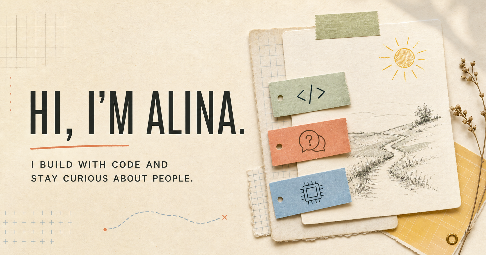

# Lab 17 — Alina Wu's Interactive Portfolio

Lab 17 is an explorable 3D portfolio built around a fictional research
workspace. Instead of presenting a conventional résumé page, it invites
visitors to investigate projects, experience, research notes, references, and
life outside the lab through objects in the room.

**[Explore Lab 17](https://alinawu.com)**



## Experience

- Explore six connected stations from a navigable 3D room.
- Open a layered desktop interface containing project and experience files.
- Inspect books, notebooks, drawer artifacts, field records, contact details,
  and a gradually revealed fax narrative.
- Use dedicated desktop, landscape-touch, and portrait layouts.
- Navigate with a pointer, keyboard, or touch controls.
- Update portfolio copy through structured files in `content/`.

## Built with

- React 19 and TypeScript
- Three.js for the room, closeups, and object interactions
- Vinext and Vite for development and production builds
- Cloudflare Workers for production hosting
- JSON-based content modules for editable portfolio copy
- Node's built-in test runner and ESLint for validation

## Run locally

### Requirements

- Node.js 22.13.0 or newer; Node.js 22 LTS is recommended
- npm, included with Node.js
- Git, if cloning the repository

No global npm packages, Cloudflare account, database, API key, or `.env` file
is required for local development.

Confirm the installed versions:

```bash
node --version
npm --version
```

### Install

Clone the repository and enter the project directory:

```bash
git clone https://github.com/alinaaaw/portfolio.git
cd portfolio
```

Install the exact dependency versions recorded in `package-lock.json`:

```bash
npm ci
```

Run `npm ci` again after the lockfile changes or when setting up the project on
a different computer. Do not copy `node_modules` between operating systems.

### Start localhost

```bash
npm run dev -- --hostname 127.0.0.1 --port 3000
```

Open [http://127.0.0.1:3000](http://127.0.0.1:3000). Keep the terminal open
while using the site, and press `Ctrl + C` to stop the development server.

### macOS

Install Node.js 22 with the official installer or a version manager such as
`nvm`, then use the standard commands above. With `nvm`:

```bash
nvm install 22
nvm use 22
npm ci
npm run dev -- --hostname 127.0.0.1 --port 3000
```

The optional `.runtime` directory is a Windows x64 convenience environment. It
is excluded from Git and is not needed on macOS or Linux.

### Windows shortcut

The original Windows development setup can be opened with
`START-WEBSITE.cmd`. It uses the local `.runtime` environment and opens the
browser automatically. A checkout obtained from GitHub should use the standard
Node.js and npm setup above unless that runtime has been installed separately.

## Available scripts

| Command | Purpose |
| --- | --- |
| `npm run dev` | Start the development server |
| `npm run build` | Create a production build |
| `npm run start` | Start the built application |
| `npm run lint` | Run ESLint across the project |
| `npm test` | Build the site and run the rendered-site test suite |

Before committing a significant change, run:

```bash
npm run lint
npm test
```

## Content architecture

Editable portfolio copy is kept separate from the scene components:

| Location | Contents |
| --- | --- |
| `content/computer.json` | Projects, experience, README, and Lab Log files |
| `content/books.json` | Bookshelf titles and related media |
| `content/notebook.json` | Project thinking and development notes |
| `content/board.json` | Principles, plans, and the planning board |
| `content/drawer.json` | Physical artifacts and supporting evidence |
| `content/field-case.json` | Experiments and life outside the lab |
| `content/fax-contact.json` | Contact card and fax narrative |
| `content/room.json` | Room labels and exploration hints |

See [`content/CONTENT_GUIDE.md`](content/CONTENT_GUIDE.md) before changing a
schema or adding a new content type. Existing projects and experiences can
usually be updated directly in JSON; application code is only needed for a new
layout, interaction, or data shape.

## Project structure

```text
app/
  _assets/                  Portfolio images and artifact media
  _components/              3D scenes, closeups, and responsive interfaces
  layout.tsx                Metadata and application shell
  page.tsx                  Main experience state and content rendering
content/                    Editable portfolio content and schemas
public/                     Global styles and social preview assets
tests/                      Rendered-site and release checks
worker/                     Cloudflare Worker entry point
DESIGN.md                   Visual, modeling, and interaction rules
CHANGELOG.md                Public release history
TODO.md                     Product backlog and launch checklist
```

## Releases

Release notes are recorded in [`CHANGELOG.md`](CHANGELOG.md). Tagged builds and
their full notes are available on the
[GitHub Releases page](https://github.com/alinaaaw/portfolio/releases).
